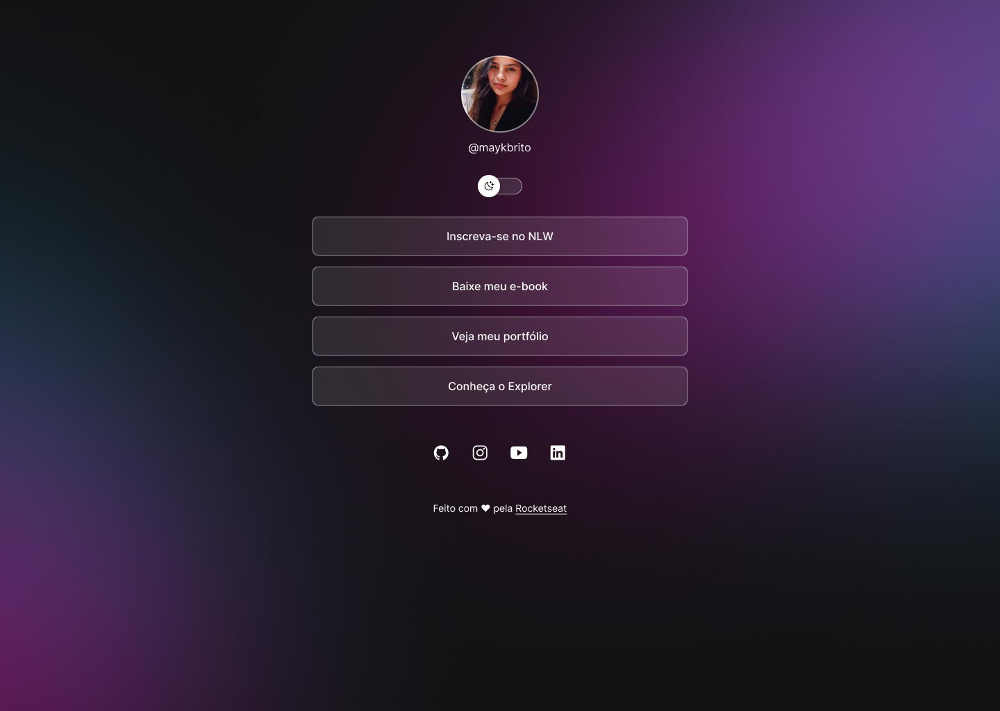

<h1 align="center">Pagina de Links</h1>

 Projeto de aprendizagem do curso Discover da Rocketseat

## 🚀 Tecnologias

Esse projeto foi desenvolvido com as seguintes tecnologias

- HTML e CSS
- JavaScript
- git e Github
- Figma

## 💻 Projeto

A Página de Links é um agregador de links para usar como cartão de visitas online